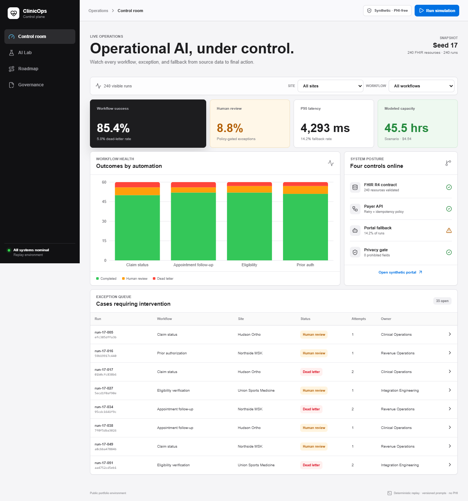

# ClinicOps AI Control Plane

[](https://github.com/vedantt17/clinicops-ai-control-plane/actions/workflows/ci.yml)

**Live application:** [clinicops-ai-control-plane.vercel.app](https://clinicops-ai-control-plane.vercel.app)

A production-minded, public simulation of the AI and automation layer behind healthcare back-office operations. It shows how an operator can prioritize workflows, ingest FHIR-shaped data, recover from upstream failures, route uncertainty to people, monitor reliability, compare tooling approaches, and document change safely.

> **Data boundary:** every record and metric is synthetic. The application contains no PHI, PII, customer data, or realized business impact.



## What a reviewer can exercise

- Run 240 deterministic workflow cases across eligibility, prior authorization, claim status, and appointment follow-up.
- Inspect completed, human-review, and dead-letter outcomes with owners, retry attempts, channels, latency, and reasons.
- Review a six-item automation roadmap with transparent volume, handling-time, impact, effort, confidence, and control assumptions.
- Compare direct FHIR, portal-robot, and managed-integration approaches through a weighted vendor scorecard.
- Open a synthetic payer portal used by Playwright as a browser-automation fallback.
- Inspect PHI-safe audit events and verify that prohibited FHIR fields are absent.

## Architecture

```text
Synthetic FHIR R4 bundle
        |
        v
Contract + privacy validation
        |
        v
Deterministic workflow engine ----> Human review queue
        |                                   |
        | API failure                       v
        +----> Portal fallback -----> PHI-safe audit log
        |
        v
Reliability metrics + roadmap + vendor scorecard
        |
        v
Next.js control plane
```

See [architecture](docs/architecture.md), [runbook](docs/runbook.md), [security boundary](docs/security.md), [data provenance](docs/data-provenance.md), [vendor methodology](docs/vendor-scorecard.md), and the [evidence ledger](docs/evidence-ledger.md).

## Stack

- Next.js 16, React 19, TypeScript
- Recharts and Lucide React
- Vitest for workflow, metric, and privacy tests
- Playwright for desktop/mobile and portal-fallback flows
- GitHub Actions for lint, test, and production-build gates
- Vercel deployment target

## Local setup

```bash
npm install
npm run dev
```

Open `http://localhost:3000`.

## Quality gates

```bash
npm run lint
npm test
npm run build
npm run test:e2e
```

Verified release checks:

- 7 unit and privacy tests passed.
- 6 Playwright workflows passed across desktop and mobile Chrome profiles.
- ESLint and the Next.js production build passed.
- `npm audit` reported zero vulnerabilities after upgrading Playwright.

## Verified synthetic evidence

| Evidence | Verified value |
| --- | ---: |
| Synthetic FHIR R4 resources | 240 |
| Deterministic workflow runs | 240 |
| PHI-safe audit events | 36 |
| Automation roadmap items | 6 |
| Integration approaches scored | 3 |
| Prohibited-field detections | 0 |
| Modeled capacity | 45.5 hours |

The 45.5-hour figure is a transparent scenario calculation, not realized savings.

## Data and metric interpretation

The repository generates 60 synthetic patient references and four FHIR resource types per patient, for 240 resources. It then simulates 240 operations runs. Success rate, latency, model cost, review rate, fallback rate, and modeled capacity are deterministic scenario outputs. They are useful for testing the operating model, not evidence of production performance.

## Production hardening path

1. Replace the fixture adapter with SMART-on-FHIR OAuth2 and organization-specific resource contracts.
2. Add encrypted persistence, a durable queue, idempotency storage, tenant isolation, RBAC, and retention controls.
3. Export traces, metrics, and logs through OpenTelemetry and connect incident paging.
4. Run legal, privacy, security, and clinical-operations reviews before handling covered data.
5. Calibrate roadmap ROI against observed baseline handling time and production volumes.

## Limitations

- No real EHR, payer, patient, provider, or customer integration is claimed.
- The portal is an owned local simulation; the project does not automate a third-party website.
- Vendor scores and capacity estimates are planning scenarios.
- The public engine is deterministic and does not call a live LLM API.

## Deployment

Verified production workspace: [clinicops-ai-control-plane.vercel.app](https://clinicops-ai-control-plane.vercel.app)
